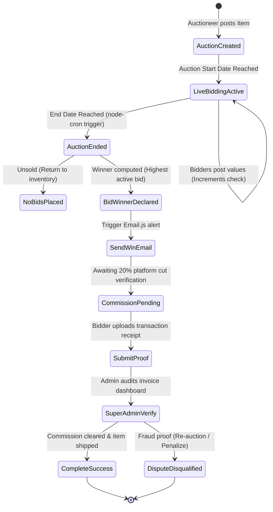
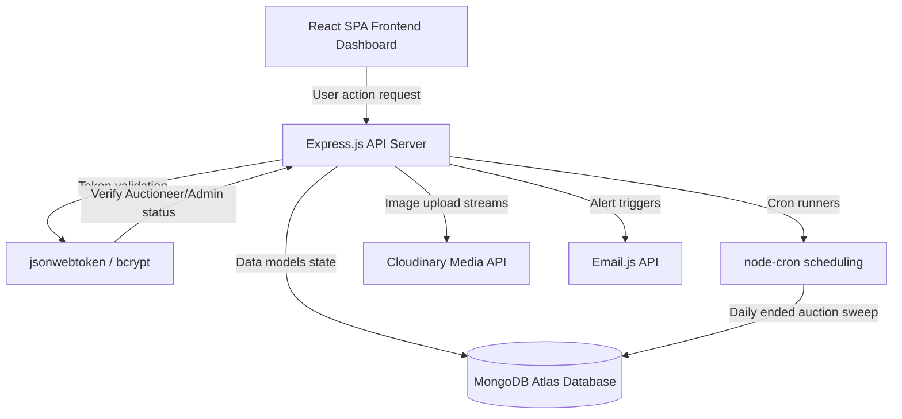

<div align="center">

<!-- Waving Royal Gradient Banner -->


<br/>

<!-- Interactive Typing Header -->
<h1>
  
</h1>

<p align="center">
  
  
  
  
  
</p>

</div>

---

## 🔨 The Secure & Scalable Bidding Universe

**NobleBid** is a highly dynamic, transparent online bidding system engineered using the **MERN Stack** (MongoDB, Express.js, React, Node.js). Designed to establish a safe, real-time environment for virtual commerce, this platform segments users into precise roles (Auctioneers, Bidders, and Super Admins) with customized dashboards, automated transaction checks, Cloudinary media pipelines, and dynamic notifications.

---

## 🚀 Key Modules & System Matrix

<div align="center">

| Role / Feature | Capabilities | Technologies / Tools |
| :--- | :--- | :--- |
| **👨💼 Auctioneer** | Create/Edit/Delete auctions, set initial bid, select end times, track live bidders. | Cloudinary SDK, MongoDB Mongoose |
| **🙋 Bidder** | Search ongoing auctions, place bids in real-time, monitor history, win item notifications. | Redux Toolkit, React Context, Axios |
| **👑 Super Admin** | Enforce fair-play, manage active users, resolve transaction disputes, view finance graphs. | Chart.js, JWT Role guards |
| **📩 Notifications** | Direct transaction, bid over, and winner alerts. | Email.js Service API, custom templates |
| **⏰ Automation** | Automatic auction end determinations and commission check schedules. | node-cron backend runners |

</div>

---

## 🏗️ Interactive System Architecture

Explore the operational lifecycles and background loops that govern NobleBid:

<details>
<summary>🔄 <b>1. The Bidding & Commission verification Pipeline</b></summary>
<br/>

From placing an initial bid to validating final commissions, trace how data changes state in MongoDB:


</details>

<details>
<summary>📡 <b>2. Full-Stack Data & Authentication Flow</b></summary>
<br/>

NobleBid runs on decoupled server-client models secured using state-of-the-art JWT authentication:


</details>

---

## 💻 Tech Stack & Operations

```
🧬 BACKEND CORE  :: Node.js • Express.js • MongoDB • Mongoose
🖼️ MEDIA STORE  :: Cloudinary API CDN
🔐 AUTHENTICATION :: Role-based JWT (jsonwebtoken) • bcrypt
📩 EMAIL ENGINE  :: Email.js templates Integration
⏰ CRON AGENTS   :: node-cron schedules
💻 FRONTEND WEB  :: React.js • Redux Toolkit (Slices) • Tailwind CSS
📊 VISUALIZATION :: Chart.js / react-chartjs-2
```

---

## 📂 Project Directory Structure

```
noble_bids/
├── BACKEND/                      # Node/Express Server
│   ├── automation/               # Background cron workers
│   │   ├── endedAuctionCron.js   # Automated winner declarations
│   │   └── verifyCommissionCron.js # Platform payment checks
│   ├── controllers/              # Request controllers
│   ├── database/                 # Mongoose connections
│   ├── middlewares/              # Role guards & global error handlers
│   ├── models/                   # Schema blueprints (users, bids, commissions)
│   ├── router/                   # API endpoint directories
│   ├── utils/                    # JWT tokens & mail utilities
│   ├── app.js                    # Core configurations
│   └── server.js                 # HTTP listener startup
└── Frontend/                     # React/Redux Client Dashboard
    ├── src/                      # Source core
    │   ├── custom-components/    # Shareable modular widgets
    │   ├── layout/               # Drawers & navbar headers
    │   ├── pages/                # Screens (Leaderboard, User Profiles, Bids)
    │   ├── store/                # Redux store structure
    │   │   ├── slices/           # State slices (auctionSlice, bidSlice, userSlice)
    │   │   └── store.js          # Main store root configuration
    │   └── App.jsx               # Navigation route hubs
```

---

## ⚙️ Interactive Customization Terminal

Explore how easy it is to customize and scale **NobleBid** parameters:

<details>
<summary>⏰ <b>1. Customizing the Cron Schedules</b></summary>

You can alter how frequently the system sweeps for ended auctions. Open [BACKEND/automation/endedAuctionCron.js](file:///c:/Users/admin/Desktop/noble_bids/BACKEND/automation/endedAuctionCron.js):
```javascript
import cron from "node-cron";

// Runs every minute to calculate dynamic endings seamlessly:
export const endedAuctionCron = () => {
  cron.schedule("*/1 * * * *", async () => {
    // Evaluation logic...
  });
};
```
</details>

<details>
<summary>💸 <b>2. Adjusting Platform Commission Cut</b></summary>

Change the platform service percentage details. Open [BACKEND/controllers/commissionController.js](file:///c:/Users/admin/Desktop/noble_bids/BACKEND/controllers/commissionController.js):
```javascript
const COMMISSION_PERCENTAGE = 0.20; // 20% flat commission rate
```
</details>

<details>
<summary>🔐 <b>3. Tweaking User JWT Token Expiry</b></summary>

Adjust active session expiration configurations. Open [BACKEND/utils/jwtToken.js](file:///c:/Users/admin/Desktop/noble_bids/BACKEND/utils/jwtToken.js):
```javascript
export const sendToken = (user, statusCode, message, res) => {
  const token = user.generateJsonWebToken();
  const cookieOptions = {
    expires: new Date(Date.now() + 7 * 24 * 60 * 60 * 1000), // 7 Days
    httpOnly: true,
  };
  // send response...
};
```
</details>

---

## 🚀 Setup & Launch Protocol

### 1. Configure Local Environments

Create a `.env` file inside the `BACKEND` directory:
```env
PORT=5000
MONGO_URI="mongodb+srv://<user>:<password>@cluster.mongodb.net/noblebids"
JWT_SECRET_KEY="ChooseAComplexCryptographicKeyHere"
JWT_EXPIRE=7d
COOKIE_EXPIRE=7
CLOUDINARY_CLIENT_NAME="YourCloudinaryName"
CLOUDINARY_CLIENT_API_KEY="YourAPIKey"
CLOUDINARY_CLIENT_API_SECRET="YourSecret"
SMTP_SERVICE="gmail"
SMTP_MAIL="yourmail@gmail.com"
SMTP_PASSWORD="your-app-specific-password"
```

### 2. Launch Backend Server
```bash
cd BACKEND
npm install
npm run dev
```

### 3. Launch Frontend Client
```bash
cd ../Frontend
npm install
npm run dev
```
Open **[http://localhost:5173](http://localhost:5173)** in your browser and start bidding!

---

## 📚 Postman Documentation  
All API endpoints, request bodies, and token payloads are meticulously cataloged in the live Postman suite:

[](https://documenter.getpostman.com/view/39190423/2sAYdeKrLc)

---

## 📄 License
This project is licensed under the terms of the **MIT License**.

---

<div align="center">

### 🌟 Go Win Your Next Bid!
*Empower your auction experience with seamless, secure real-time bidding.*


</div>
